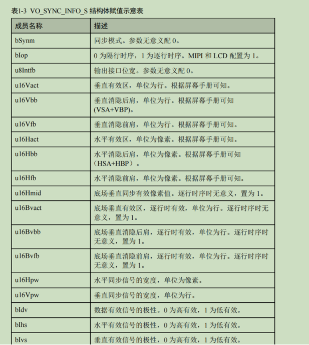
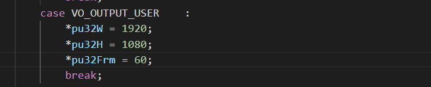
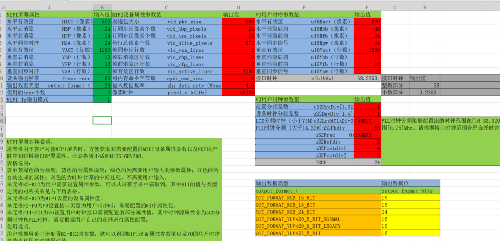
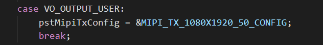

# 调试屏幕--VO
屏幕大体分为MIPI屏幕以及RGB屏幕，本文先从相对简单的RGB屏幕入手，在讲解MIPI屏幕的添加以及调试过程，这里主要用到了《屏幕对接指南--RGB部分》 《引脚功能表》
1：对于不同的核心板，gpio口的功能可能都不一样，所以需要需要重新定义一下gpio的功能，内核里修改gpio的复用功能，更改sys_conffig.c来配置，再通过himm工具来进行查看相对应寄存器的值并通过《引脚功能表》来对照所选的功能，下图是海思的一些工具；

## RGB
RGB屏幕的大致配置流程如图所示

代码分析-同样是VIO例程
代码逻辑

（1）sample_comm_vo_startvo--->sample_comm_vi_startdev
这里主要配置一下用户时序，需要使用到屏幕的数据手册，找到如下图的表格获得相应的时序，在使用海思自带的《RGB_MIPI屏幕时序计算器》将相对应的参数填入，绿色为自己需要填入的部分，红色为自动生成的部分

得到这些参数后，写入结构体中即可

（2）sample_comm_vo_getwh里，由于用的是用户时序，所以这里也需要改一下，添加一个case；

（3）至此，大体的配置已经完成，完成vo的配置后vio例程基本就可以直接跑了，上电执行sample_vio 9
注意：
 1：如果屏幕没有反应，首先看一下屏幕的上电时序是否正常，先不用管摄像头模块，可以使用colorbar来测试屏幕是否已经正常
打开 colorbar：himm 0x1144d000 0xc0000011 
关闭 colorbar：himm 0x1144d000 0x80000011

2：记得开一下色彩空间转换，不然会导致画面颜色不正常

## MIPI
Mipi屏幕在rgb的基础上多了几步
1:sample_comm_vo_startvo-->sample_comm_vo_startmipitx里先添加一个case,这些配置在 
《RGB_MIPI屏幕时序计算器》中可以直接求得，这里配置了数据传送的相应配置

接着进入sample_provate_vo_initmipitxscreen,这里主要是对mipi屏幕进行一些初始化配置寄存器的操作

至此mipi屏幕配置完成；

注意-VIO调试：
1：如果程序执行失败，可以使用cat /dev/logmpp 来查看一下详细的错误日志；
2：如果屏幕用colorbar测试是正常的但是没有出图像，则vi部分可能有问题，
这个时候需要好好调试一下vi部分，cat /proc/umap/mipi_rx,看两部分，一个是否收到数据，一个是mipi是否能正常检测分辨率；
如果没有数据发出，则可能摄像头没有正常工作，检查是否正常上电，配置是否写入，可以用i2c_read读一下确认一下；
如果没有get到分辨率，则是代码中某些分辨率还没有改，再到代码中仔细检查一下；

更改完成后，我们可以使用海思自带的工具来抓一下图
Hi3516CV500_SDK_V2.0.2.0/smp/a7_linux/mpp/tools下

可以依次抓取vi  vpss  vo的图，抓取的图可以使用“7yuv”工具进行查看，如果正确 ，则摄像头工作正常；
3:如果第二步均正常，且屏幕colorbar也正确，但仍然没有图片，则可能是背光有问题，与硬件确认背光的亮度是固定的还是可以调节的，如果可以调节，则确认背光是否已经开到最大；