## 调试sensor--VI
阅读imx214数据手册可知imx586的设备地址为0x20，在海思中它默认把i2c地址左移了一位(或低位补零)，如果是瑞芯微平台的话为0x10；

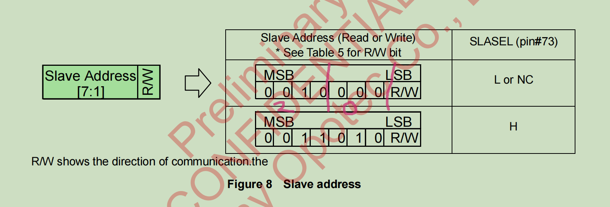

1：首先判断主控与sensor IIC通讯是否成功，可以使用i2cdetect -l来查看启用了几路I2C，再对照原理图查看自己的sensor挂载在哪一路总线上；样例挂载在I2C0上，可以读一下设备ID以判断I2C通讯是否正常，Sony的sensor设备id一般存放在0x16和0x17这两个寄存器中;
输出为0x02 0x14说明I2C读取没问题
```bash
i2c_read  0 0x34 0x0016  0x0017 2 1
```


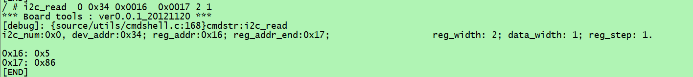

注意：如果此处的iic一直通讯不成功可以按如下步骤排查问题
（1）检查sensor上电是否正常；
（2）使用万用表测量空闲时的SCL以及SDA，应都为高电平，因为空闲状态下，SCL和SDA均应为高电平以实现线与；如果不全是高电平，则可能线路断了，可以用万用表测一下线路是否正常；
（3） 如果第一步正常，则在读ID的时候使用示波器测量一下SCL以及SDA的波形，如果仍有波形但依旧读取失败，则对照原理图以及pcb看一下SCL和SDA有没有接错。
### 补充 在终端直接操作gpio
海思GPIO转化公式：例如GPIO_4_0==>4*8+0=32
```bash
cd /sys/class/gpio
echo 32 > export
cd gpio32 
echo out > direction
echo 1 > value
cat value
```
若出现devices busy则
```bash
cat /sys/kernel/debug/gpio 
```
如果gpio口被占用，则要修改设备树；
2：IIC测试正常后就可以编写驱动程序了，这里需要用到的资料有：
《MIPI使用指南》《HIMPP开发参考》《sensor调试指南》《硬件原理图》；
使用的是sample里的vio例程,路径为：
HI3526_AR/smp/a7_linux/mpp->sample->vio这里选case 9
```c
void SAMPLE_VIO_Usage(char *sPrgNm)
{
    printf("Usage : %s <index>\n", sPrgNm);
    printf("index:\n");
    printf("\t 0)VI (Online) - VPSS(Online) - VO.\n");
    printf("\t 1)WDR(Offline)- VPSS(Offline) - VO. LDC+DIS+SPREAD.\n");
    printf("\t 2)Resolute Ratio Switch.\n");
    printf("\t 3)GDC - VPSS LowDelay.\n");
    printf("\t 4)Double WDR Pipe.\n");
    printf("\t 5)FPN Calibrate & Correction.\n");
    printf("\t 6)WDR Switch.\n");
    printf("\t 7)90/180/270/0/free Rotate.\n");
    printf("\t 8)UserPic.\n");
    printf("\t 9)VI-VPSS-VO(MIPI_TX).\n\n");

    printf("\t Hi3516DV300/Hi3559V200/Hi3556V200) vo HDMI output.\n");
    printf("\t Hi3516CV500) vo BT1120 output.\n");
    printf("\t If you have any questions, please look at readme.txt!\n");
    return;
}
```
### 新增一款imx214
1：首先复制一款同平台相近sensor驱动，这里选用的是imx307，复制改名为imx214，路径为:
/HI3526_AR/smp/a7_linux/mpp/component/isp/user/sensor
主要修改ctrl.c文件中的寄存器配置，此文件主要是底层控制，使用iic来向sensor的相应寄存器写入相应的数据，cmos.c主要定义上层以及回调函数；

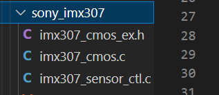

```c
/* 1080P30 and 1080P25 */
void imx214_linear_1080p30_init(VI_PIPE ViPipe)
{
        // BASIC SETTING  TOTAL 20
    imx214_write_register(ViPipe, 0x0101, 0x00);     
    imx214_write_register(ViPipe, 0x0105, 0x01);     
    imx214_write_register(ViPipe, 0x0106, 0x01);
    imx214_write_register(ViPipe, 0x4550, 0x02);
    imx214_write_register(ViPipe, 0x4601, 0x04);     
    imx214_write_register(ViPipe, 0x4642, 0x01);
    imx214_write_register(ViPipe, 0x6227, 0x11);
    imx214_write_register(ViPipe, 0x9276, 0x00);
    imx214_write_register(ViPipe, 0x900E, 0x06);
    imx214_write_register(ViPipe, 0xA802, 0x90);
    imx214_write_register(ViPipe, 0xA803, 0x11);
    imx214_write_register(ViPipe, 0xA804, 0x62);
    imx214_write_register(ViPipe, 0xA805, 0x77);
    imx214_write_register(ViPipe, 0xA806, 0xAE);
    imx214_write_register(ViPipe, 0xA807, 0x34);
    imx214_write_register(ViPipe, 0xA808, 0xAE);
    imx214_write_register(ViPipe, 0xA809, 0x35);
    imx214_write_register(ViPipe, 0xA80A, 0x62);
    imx214_write_register(ViPipe, 0xA80B, 0x83);
    imx214_write_register(ViPipe, 0xAE33, 0x00);
//ANALOG SETTING TOTAL 28
    imx214_write_register(ViPipe, 0x4174, 0x00);
    imx214_write_register(ViPipe, 0x4175, 0x11);
    imx214_write_register(ViPipe, 0x4612, 0x29);
    imx214_write_register(ViPipe, 0x461B, 0x2C);
    imx214_write_register(ViPipe, 0x461F, 0x06);
    imx214_write_register(ViPipe, 0x4635, 0x07);
    imx214_write_register(ViPipe, 0x4637, 0x30);
    imx214_write_register(ViPipe, 0x463F, 0x18);
    imx214_write_register(ViPipe, 0x4641, 0x0D);
    imx214_write_register(ViPipe, 0x465B, 0x2C);
    imx214_write_register(ViPipe, 0x465F, 0x2B);
    imx214_write_register(ViPipe, 0x4663, 0x2B);
    imx214_write_register(ViPipe, 0x4667, 0x24);
    imx214_write_register(ViPipe, 0x466F, 0x24);
    imx214_write_register(ViPipe, 0x470E, 0x09);
    imx214_write_register(ViPipe, 0x4909, 0xAB);
    imx214_write_register(ViPipe, 0x490B, 0x95);
    imx214_write_register(ViPipe, 0x4915, 0x5D);
    imx214_write_register(ViPipe, 0x4A5F, 0xFF);
    imx214_write_register(ViPipe, 0x4A61, 0xFF);
    imx214_write_register(ViPipe, 0x4A73, 0x62);
    imx214_write_register(ViPipe, 0x4A85, 0x00);
    imx214_write_register(ViPipe, 0x4A87, 0xFF);
   // imx214_write_register(ViPipe, 0x583C, 0x04);
    imx214_write_register(ViPipe, 0x620E, 0x04);
    imx214_write_register(ViPipe, 0x6EB2, 0x01);
    imx214_write_register(ViPipe, 0x6EB3, 0x00);
    imx214_write_register(ViPipe, 0x9300, 0x02);
 //image Quality 
 //HDR setting

    imx214_write_register(ViPipe, 0x3001, 0x07);
    imx214_write_register(ViPipe, 0x9344, 0x03);
    imx214_write_register(ViPipe, 0x9706, 0x10);
    imx214_write_register(ViPipe, 0x9707, 0x03);
    imx214_write_register(ViPipe, 0x9708, 0x03);
    imx214_write_register(ViPipe, 0x97BE, 0x01);
    imx214_write_register(ViPipe, 0x97BF, 0x01);
    imx214_write_register(ViPipe, 0x97C0, 0x01);
    imx214_write_register(ViPipe, 0x9E04, 0x01);
    imx214_write_register(ViPipe, 0x9E05, 0x00);
    imx214_write_register(ViPipe, 0x9E0C, 0x01);
    imx214_write_register(ViPipe, 0x9E0D, 0x02);
    imx214_write_register(ViPipe, 0x9E24, 0x00);
    imx214_write_register(ViPipe, 0x9E25, 0x8C);
    imx214_write_register(ViPipe, 0x9E26, 0x00);
    imx214_write_register(ViPipe, 0x9E27, 0x94);
    imx214_write_register(ViPipe, 0x9E28, 0x00);
    imx214_write_register(ViPipe, 0x9E29, 0x96);
     	// CNR Setting
    imx214_write_register(ViPipe, 0x69DB, 0x01);
	     // Moire reduction Parameter Setting
    imx214_write_register(ViPipe, 0x6957, 0x01);
         // Image enhancement Setting
    imx214_write_register(ViPipe, 0x6987, 0x17);
    imx214_write_register(ViPipe, 0x698A, 0x03);
    imx214_write_register(ViPipe, 0x698B, 0x03);
      // White Balance Setting
    imx214_write_register(ViPipe, 0x0B8E, 0x01);
    imx214_write_register(ViPipe, 0x0B8F, 0x00);
    imx214_write_register(ViPipe, 0x0B90, 0x01);
    imx214_write_register(ViPipe, 0x0B91, 0x00);
    imx214_write_register(ViPipe, 0x0B92, 0x01);
    imx214_write_register(ViPipe, 0x0B93, 0x00);
    imx214_write_register(ViPipe, 0x0B94, 0x01);
    imx214_write_register(ViPipe, 0x0B95, 0x10);
      	// ATR Setting
    imx214_write_register(ViPipe, 0x6E50,0x00);
    imx214_write_register(ViPipe, 0x6E51,0x32);
    imx214_write_register(ViPipe, 0x9340,0x00);
    imx214_write_register(ViPipe, 0x9341,0x3C);
    imx214_write_register(ViPipe, 0x9342,0x03);
    imx214_write_register(ViPipe, 0x9343,0xFF);

// Mode setting setting TOTAL 26
    imx214_write_register(ViPipe, 0x0114, 0x03);
    imx214_write_register(ViPipe, 0x0220, 0x00);
    imx214_write_register(ViPipe, 0x0221, 0x11);
    imx214_write_register(ViPipe, 0x0222, 0x01);
    imx214_write_register(ViPipe, 0x0340, 0x04);
    imx214_write_register(ViPipe, 0x0341, 0x68);
    imx214_write_register(ViPipe, 0x0342, 0x13);
    imx214_write_register(ViPipe, 0x0343, 0x90);
    imx214_write_register(ViPipe, 0x0344, 0x04);
    imx214_write_register(ViPipe, 0x0345, 0x78);
    imx214_write_register(ViPipe, 0x0346, 0x03);
    imx214_write_register(ViPipe, 0x0347, 0xFC);
    imx214_write_register(ViPipe, 0x0348, 0x0B);
    imx214_write_register(ViPipe, 0x0349, 0xF7);
    imx214_write_register(ViPipe, 0x034A, 0x08);
    imx214_write_register(ViPipe, 0x034B, 0x33);
    imx214_write_register(ViPipe, 0x0381, 0x01);
    imx214_write_register(ViPipe, 0x0383, 0x01);
    imx214_write_register(ViPipe, 0x0385, 0x01);
    imx214_write_register(ViPipe, 0x0387, 0x01);
    imx214_write_register(ViPipe, 0x0900, 0x00);
    imx214_write_register(ViPipe, 0x0901, 0x00);
    imx214_write_register(ViPipe, 0x0902, 0x00);
    imx214_write_register(ViPipe, 0x3000, 0x35);
    imx214_write_register(ViPipe, 0x3054, 0x01);
    imx214_write_register(ViPipe, 0x305C, 0x11);
//Output Size setting TOTAL17
    imx214_write_register(ViPipe, 0x0112,0x0A);
    imx214_write_register(ViPipe, 0x0112, 0x0A);
    imx214_write_register(ViPipe, 0x034C, 0x07);
    imx214_write_register(ViPipe, 0x034D, 0x80);
    imx214_write_register(ViPipe, 0x034E, 0x04);
    imx214_write_register(ViPipe, 0x034F, 0x38);
    imx214_write_register(ViPipe, 0x0401, 0x00);
    imx214_write_register(ViPipe, 0x0404, 0x00);
    imx214_write_register(ViPipe, 0x0405, 0x01);
    imx214_write_register(ViPipe, 0x0408, 0x00);
    imx214_write_register(ViPipe, 0x0409, 0x00);
    imx214_write_register(ViPipe, 0x040A, 0x00);
    imx214_write_register(ViPipe, 0x040B, 0x00);
    imx214_write_register(ViPipe, 0x040C, 0x07);
    imx214_write_register(ViPipe, 0x040D, 0x80);
    imx214_write_register(ViPipe, 0x040E, 0x04);
    imx214_write_register(ViPipe, 0x040F, 0x38);
//Clock setting  TOTAL 8
    imx214_write_register(ViPipe, 0x0301, 0x05);
    imx214_write_register(ViPipe, 0x0303, 0x02);
    imx214_write_register(ViPipe, 0x0305, 0x03);
    imx214_write_register(ViPipe, 0x0306, 0x00);
    imx214_write_register(ViPipe, 0x0307, 0x58);
    imx214_write_register(ViPipe, 0x0309, 0x0A);
    imx214_write_register(ViPipe, 0x030B, 0x01);
    imx214_write_register(ViPipe, 0x0310, 0x00);
       //DATARATING 
    imx214_write_register(ViPipe, 0x0820, 0x0D);
    imx214_write_register(ViPipe, 0x0821, 0x40);
    imx214_write_register(ViPipe, 0x0822, 0x00);
    imx214_write_register(ViPipe, 0x0823, 0x00);
//WaterMark setting TOTAL  3
    imx214_write_register(ViPipe, 0x3A03, 0x06);
    imx214_write_register(ViPipe, 0x3A04, 0x68);
    imx214_write_register(ViPipe, 0x3A05, 0x01);
    //Enable setting TOTAL
    imx214_write_register(ViPipe, 0x0B06, 0x01);
    imx214_write_register(ViPipe, 0x30A2, 0x00);
     imx214_write_register(ViPipe, 0x4018, 0x00);
    //test setting TOTAL
    imx214_write_register(ViPipe, 0x30B4, 0x00);
        //HDR setting TOTAL
    imx214_write_register(ViPipe, 0x3A02, 0xFF);
        //STATS setting TOTAL
    imx214_write_register(ViPipe, 0x3011, 0x00);
    imx214_write_register(ViPipe, 0x3013, 0x01);
    imx214_write_register(ViPipe, 0x5040, 0x01);
        //Integration Time  setting TOTAL
    imx214_write_register(ViPipe, 0x0202, 0x03);
    imx214_write_register(ViPipe, 0x0203, 0xE8);
    imx214_write_register(ViPipe, 0x0224, 0x01);
    imx214_write_register(ViPipe, 0x0225, 0xF4);
        //gain  setting TOTAL 12
    imx214_write_register(ViPipe, 0x2024, 0x01);
    imx214_write_register(ViPipe, 0x0205, 0x00);
    imx214_write_register(ViPipe, 0x020E, 0x01);
    imx214_write_register(ViPipe, 0x020F, 0x00);
    imx214_write_register(ViPipe, 0x0210, 0x01);
    imx214_write_register(ViPipe, 0x0211, 0x00);
    imx214_write_register(ViPipe, 0x0212, 0x01);
    imx214_write_register(ViPipe, 0x0213, 0x00);
    imx214_write_register(ViPipe, 0x0214, 0x01);
    imx214_write_register(ViPipe, 0x0215, 0x00);
    imx214_write_register(ViPipe, 0x0216, 0x00);
    imx214_write_register(ViPipe, 0x0217, 0x00);
   // Analog Setting total 
    imx214_write_register(ViPipe, 0x4170, 0x00);
    imx214_write_register(ViPipe, 0x4171, 0x10);
    imx214_write_register(ViPipe, 0x4176, 0x00);
    imx214_write_register(ViPipe, 0x4177, 0x3C);
    imx214_write_register(ViPipe, 0xAE20, 0x04);
    imx214_write_register(ViPipe, 0xAE21, 0x5C);

    //longer than 10msec from Power On
    imx214_write_register(ViPipe, 0x0138, 0x01);
    imx214_write_register(ViPipe, 0x0100, 0x01);
    
    // Software Standby setting
    imx214_write_register(ViPipe, 0x0100, 0x00);
    //ATR Setting
    imx214_write_register(ViPipe, 0x9300, 0x02);
    //External Clock Setting
    imx214_write_register(ViPipe, 0x136, 0x18);
    imx214_write_register(ViPipe, 0x137, 0x00);

    imx214_write_register(ViPipe, 0x0100, 0x01); 
    printf("==============================================================\n");
    printf("===Sony imx214 sensor 1080P30fps(MIPI_wzw_C6_self0514_1.1) init success!=====\n");
    printf("==============================================================\n");
    return;
}
```
注意：新增sensor后要重新生成新的驱动库，需要修改一下Makefile

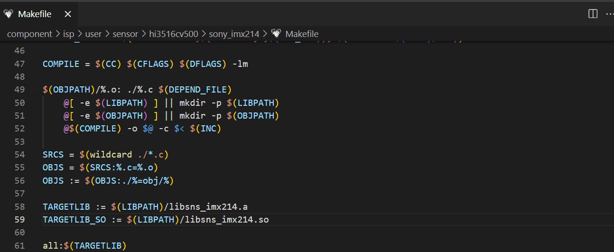

以及重新make一下生成新的驱动
```bash
cd /HI3526_AR/smp/a7_linux/mpp/component/isp/user
make clean
make
```
生成的驱动路径/home/wzw/01-01-Hisi_Platform/C6/clover6/smp/a7_linux/mpp/lib
可以看到已经生成imx214的.a .so库

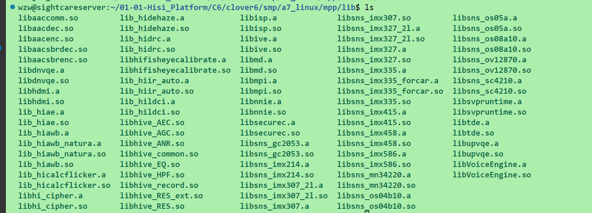

至此，imx214驱动添加成功。

2：接着修改sample中的vio例程，实质上调用的都是common的的程序，主要修改sample_comm_vi.c以及sample_comm_isp.c;
（1）sample_common.h中添加，以及加载相应的库
```c
typedef enum hiSAMPLE_SNS_TYPE_E
{
    SONY_IMX327_MIPI_2M_30FPS_12BIT,
    SONY_IMX327_MIPI_2M_30FPS_12BIT_WDR2TO1,
    SONY_IMX327_2L_MIPI_2M_30FPS_12BIT,
    SONY_IMX327_2L_MIPI_2M_30FPS_12BIT_WDR2TO1,
    SONY_IMX307_MIPI_2M_30FPS_12BIT,
    SONY_IMX307_MIPI_2M_30FPS_12BIT_WDR2TO1,
    SONY_IMX307_2L_MIPI_2M_30FPS_12BIT,
    SONY_IMX307_2L_MIPI_2M_30FPS_12BIT_WDR2TO1,
    SONY_IMX335_MIPI_5M_30FPS_12BIT,
    SONY_IMX335_MIPI_5M_30FPS_10BIT_WDR2TO1,
    SONY_IMX335_MIPI_4M_30FPS_12BIT,
    SONY_IMX335_MIPI_4M_30FPS_10BIT_WDR2TO1,
    SONY_IMX458_MIPI_8M_30FPS_10BIT,
    SONY_IMX458_MIPI_12M_20FPS_10BIT,
    SONY_IMX458_MIPI_4M_60FPS_10BIT,
    SONY_IMX458_MIPI_4M_40FPS_10BIT,
    SONY_IMX458_MIPI_2M_90FPS_10BIT,
    SONY_IMX458_MIPI_1M_129FPS_10BIT,
    SMART_SC4210_MIPI_3M_30FPS_12BIT,
    SMART_SC4210_MIPI_3M_30FPS_10BIT_WDR2TO1,
    PANASONIC_MN34220_LVDS_2M_30FPS_12BIT,
    OMNIVISION_OS04B10_MIPI_4M_30FPS_10BIT,
    OMNIVISION_OS05A_MIPI_4M_30FPS_12BIT,
    OMNIVISION_OS05A_MIPI_4M_30FPS_10BIT_WDR2TO1,
    OMNIVISION_OS08A10_MIPI_8M_30FPS_10BIT,
    GALAXYCORE_GC2053_MIPI_2M_30FPS_10BIT,
    OMNIVISION_OV12870_MIPI_1M_240FPS_10BIT,
    OMNIVISION_OV12870_MIPI_2M_120FPS_10BIT,
    OMNIVISION_OV12870_MIPI_8M_30FPS_10BIT,
    OMNIVISION_OV12870_MIPI_12M_30FPS_10BIT,
    SONY_IMX415_MIPI_8M_30FPS_12BIT,
    SONY_IMX415_MIPI_8M_20FPS_12BIT,
    SONY_IMX214_MIPI, //imx214
    SAMPLE_SNS_TYPE_BUTT,
} SAMPLE_SNS_TYPE_E;
```
更改如下文件

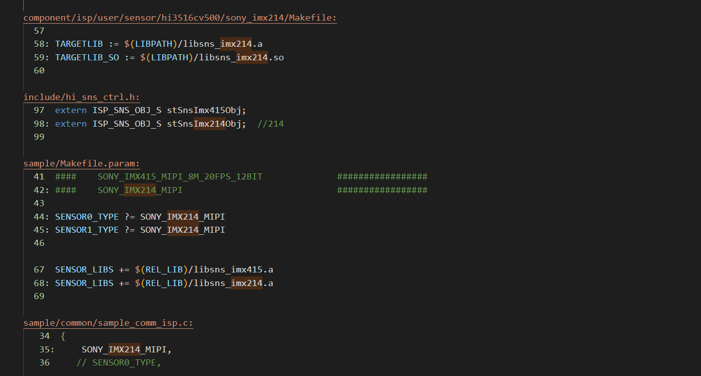

## VI代码讲解
### 代码逻辑

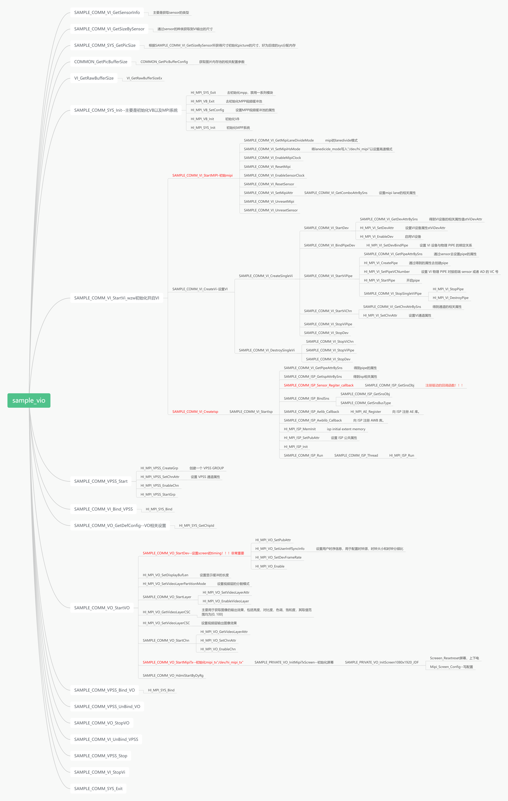

首先获得sensor的类型，这里可以看到是从Makefile.param中获取到sensor type的；

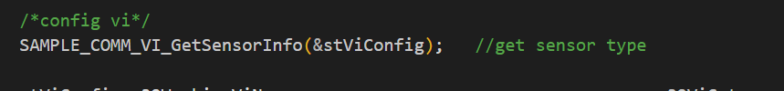

```c
HI_VOID SAMPLE_COMM_VI_GetSensorInfo(SAMPLE_VI_CONFIG_S* pstViConfig)
{
    HI_S32 i;

    for (i = 0; i < VI_MAX_DEV_NUM; i++)
    {
        pstViConfig->astViInfo[i].stSnsInfo.s32SnsId = i;
        pstViConfig->astViInfo[i].stSnsInfo.s32BusId = i;
        pstViConfig->astViInfo[i].stSnsInfo.MipiDev  = i;
        memset_s(&pstViConfig->astViInfo[i].stSnapInfo, sizeof(SAMPLE_SNAP_INFO_S), 0, sizeof(SAMPLE_SNAP_INFO_S));
        pstViConfig->astViInfo[i].stPipeInfo.bMultiPipe = HI_FALSE;
        pstViConfig->astViInfo[i].stPipeInfo.bVcNumCfged = HI_FALSE;
    }

    pstViConfig->astViInfo[0].stSnsInfo.enSnsType = SENSOR0_TYPE;  
    pstViConfig->astViInfo[1].stSnsInfo.enSnsType = SENSOR1_TYPE;
}
```
Makefile.Param

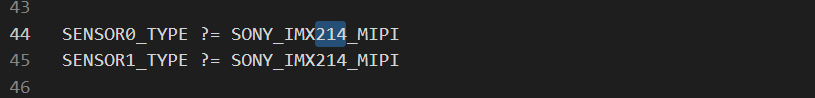

（3）sample_comm_vi_getsize里添加一个case，sample_comm_sys_getpicsize也自己添加一下（如果有新的分辨率的话）

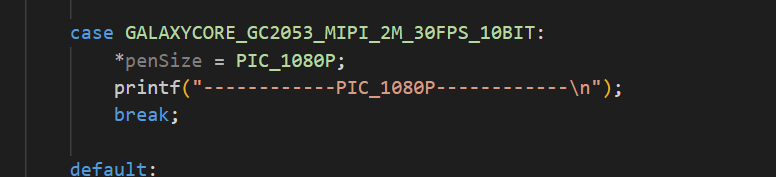
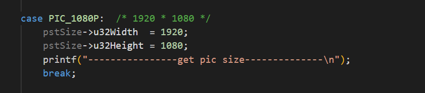

（4）sample_comm_vi_startvi-->sample_comm_vi_startmipi-->sample_comm_vi_setmipiattr-->sample_comm_vi_getcomboattrbysns中新增一条case,这里是4lane，标号为0，1，2，3，如果只有2lane则为0，1，-1，-1


```c
combo_dev_attr_t MIPI_4lane_CHN0_SENSOR_IMX214 =         //add by wzw
{
    .devno = 0,
    .input_mode = INPUT_MODE_MIPI,
    .data_rate = MIPI_DATA_RATE_X1,
    .img_rect = {0, 0, 1920, 1080},

    {
        .mipi_attr =
        {
            DATA_TYPE_RAW_10BIT,
            HI_MIPI_WDR_MODE_NONE,
            {0, 1, 2, 3}
        }
    }
};
```
（5）sample_comm_vi_startvi-->sample_comm_vi_createvi-->sample_comm
_createsinglevi-->sample_comm_vi_satrtdev-->sample_comm_vi_getattrbysns中新增一个case

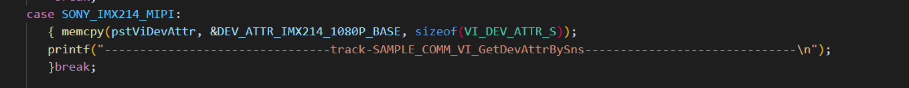

```c
VI_DEV_ATTR_S DEV_ATTR_IMX214_1080P_BASE =            //add by wzw
{
    VI_MODE_MIPI,
    VI_WORK_MODE_1Multiplex,
    {0xFFF00000,    0x0},
    VI_SCAN_PROGRESSIVE,
    {-1, -1, -1, -1},
    VI_DATA_SEQ_YUYV,

    {
    /*port_vsync   port_vsync_neg     port_hsync        port_hsync_neg        */
    VI_VSYNC_PULSE, VI_VSYNC_NEG_LOW, VI_HSYNC_VALID_SINGNAL,VI_HSYNC_NEG_HIGH,VI_VSYNC_VALID_SINGAL,VI_VSYNC_VALID_NEG_HIGH,

    /*hsync_hfb    hsync_act    hsync_hhb*/
    {0,            1920,        0,
    /*vsync0_vhb vsync0_act vsync0_hhb*/
     0,            1080,        0,
    /*vsync1_vhb vsync1_act vsync1_hhb*/
     0,            0,            0}
    },
    VI_DATA_TYPE_RGB,
    HI_FALSE,
    {1920, 1080},
    {
        {
            {1920 , 1080},

        },
        {
            VI_REPHASE_MODE_NONE,
            VI_REPHASE_MODE_NONE
        }
    },
    {
        WDR_MODE_NONE,
        1080
    },
    DATA_RATE_X1
};
```
（6）sample_comm_vi_startvi中重点看一下sample_comm_createisp函数--->sample_comm_vi_startisp-->sample_comm_vi_getpipesttrbysns添加一个case，这里主要设置管道的属性


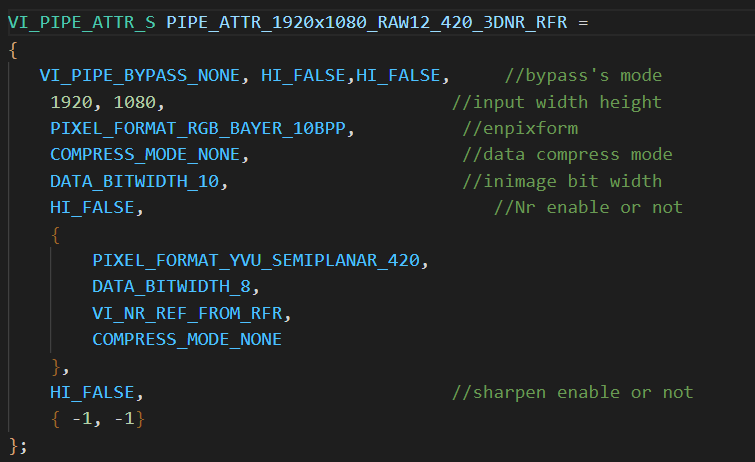

接着是sample_comm_isp_getispttrbysns同样添加一条case，主要是isp的一些公共属性
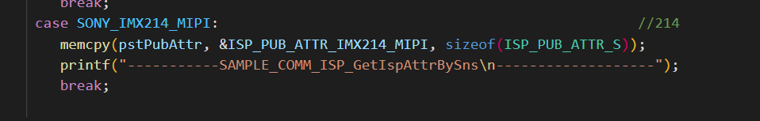

```c
ISP_PUB_ATTR_S ISP_PUB_ATTR_IMX214_MIPI =                //214                    
{
    {0, 0, 1920, 1080},
    {1920, 1080},
    60,
    BAYER_RGGB,
    WDR_MODE_NONE,
    0,
};
```
最后是注册一下回调函数
sample_comm_isp_sensor_register_callback-->sample_comm_isp_getsensob;


至此VI部分更改完成。

注意：
1：按照以上步骤会有两个问题
提示找不到stSnsImx214Obj文件，这是因为Makefile.param里未添加

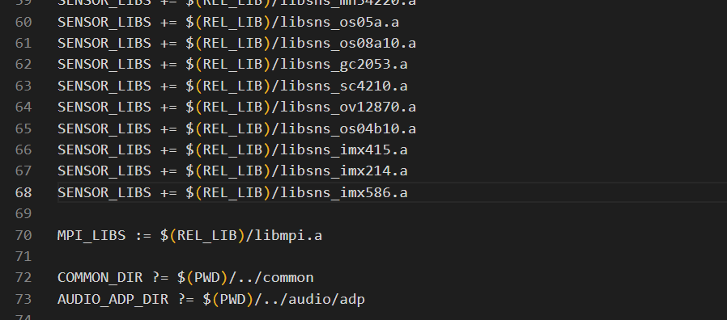

第二个问题如下，提示驱动力的ISP_TRACE找不到相关定义

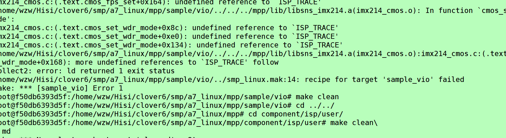

解决方法

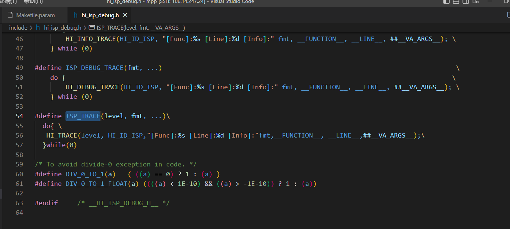

2：海思平台的sensor驱动是应用层驱动，目的是为了方便快速更换sensor；